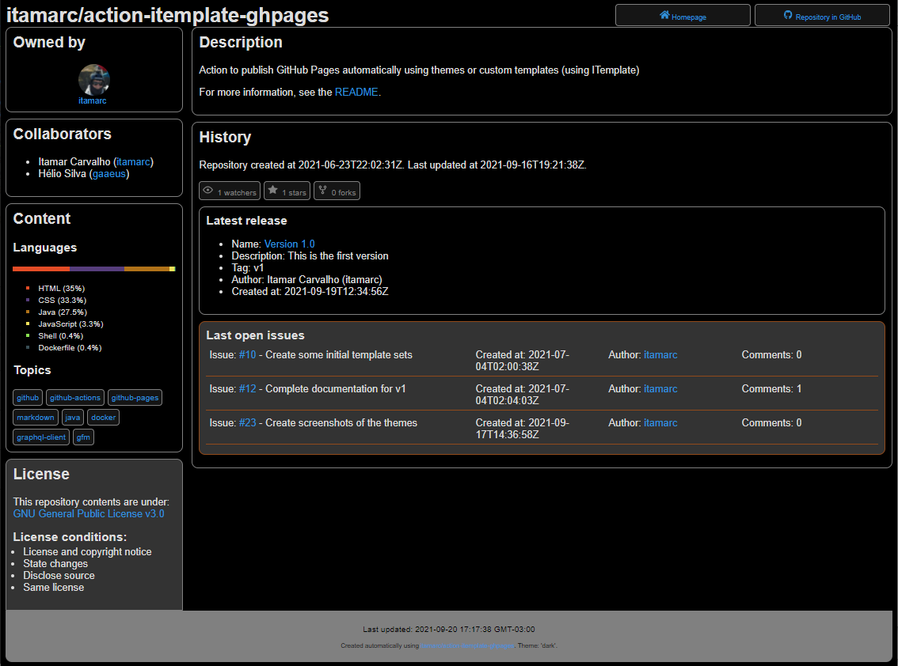
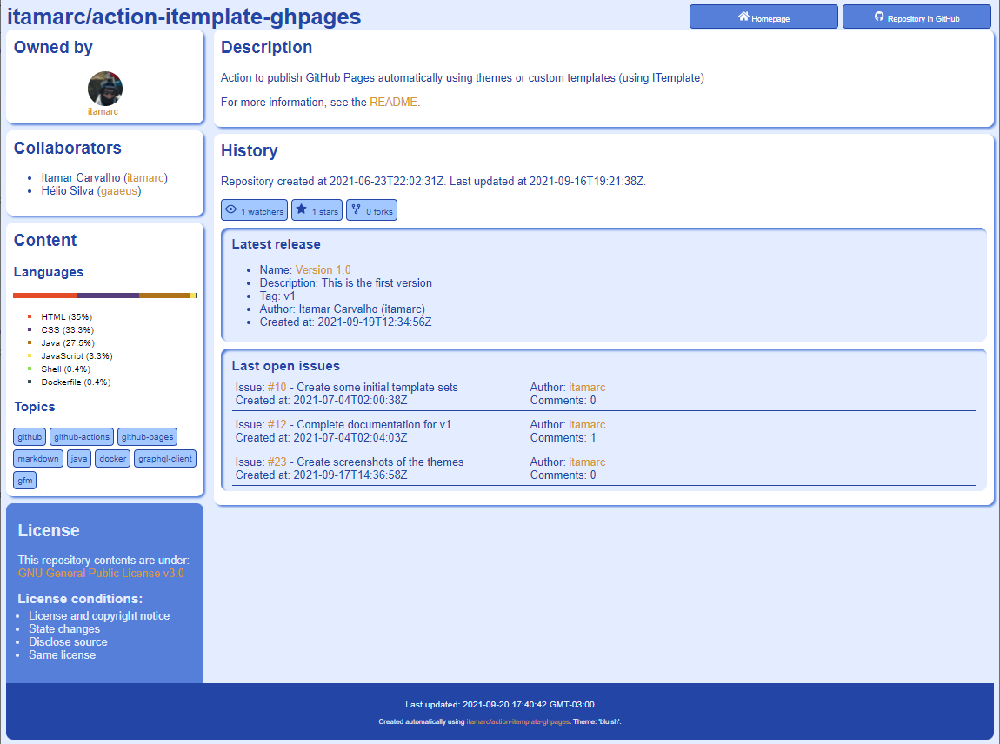

# Available Themes

Below you can find screenshots of the themes that are available.

(The images were taken with zoom level set to 80% in Google Chrome.)

---
## Theme :reference:

---
## Theme :light:

---
## Theme :light: with `README.md` inline

---
## Theme :dark:

---
## Theme :bluish:

---
## Theme :greenish:

---
## Theme :purplish:

---
## Theme :grayish:

---
## Theme :greenscreen:

